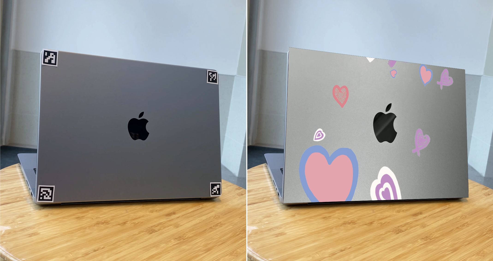

# Augmented Reality with ArUco

ArUco Markers are black and white images with a predefined pattern. In this program, we will create an an augmented reality using ArUco Markers along with:
- A "destination" video that has a physical object sticked with ArUco Markers to create a Region of Interest (ROI) (as shown in the LEFT-side of the image below).
- A "source" video that will be warped into the ROI in the destination video (as shown in the RIGHT-side of the image below).

> For a closer look, let's watch this Youtube video: [AR with ArUco](https://youtu.be/fv4-aiWprAw).

## Overal approaches:
- Detect the markers within this image
- Identify the pixel coordinates associated with the four points that define the ROI
- Use homography and image warping to replace the ROI with a "source" image of our choice

# Notes:
Since our files are large, we will not upload it into GitHub. If you want to download those files, here is the [AR-aruco's Drive folder](https://drive.google.com/drive/folders/1hn6CpxgXT0DZN9JS7fYxgZkOvbOp7tjx?usp=sharing).

## Acknowledgements: 
Professor Duong M. Phung from Fulbright University Vietnam